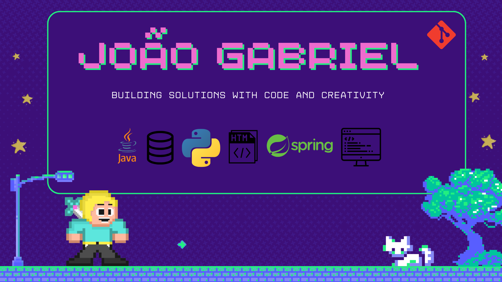

  

# 👋 Olá, eu sou o João Gabriel!

Sou formado em **Sistemas de Informação** com pós-graduação em **Ciência de Dados e Transformação Digital**. Atuo como desenvolvedor Full Stack, com foco em Java (Spring), Angular e banco de dados Oracle. Atualmente, estou estudando Python e Inteligência Artificial/Machine Learning.

> 🇬🇧 **English version below!**

## 🚀 Sobre mim

- 🎓 **Formação:**  
  - Bacharel em Sistemas de Informação  
  - Pós-graduação em Ciência de Dados com Ênfase em Transformação Digital

- 💼 **Experiência:**  
  - Mais de 10 anos de experiência em desenvolvimento de software
  - Atuação como Full Stack Developer: Java (Spring), Angular, Oracle, .NET, Vue.js, JavaScript
  - Experiência com metodologias ágeis, análise de requisitos, implantação e monitoramento de aplicações

- 🧠 **Atualmente aprendendo:**  
  - Python, IA/ML, Engenharia de Dados, APIs modernas

- 🏆 **Destaques:**  
  - Participante e finalista de desafios de inovação (LeanIT)
  - Criador de indicadores de performance e automações em times de TI

---

## 🛠️ **Skills / Tecnologias**

  
  
  
  
  
  
  
  
  
  
  
  
  
  

---

## 💻 **Projetos em destaque**

- [Veja todos os projetos no meu perfil!](https://github.com/jgsoliveira90?tab=repositories)

---

## 📊 **Estatísticas do GitHub**

  
  

---

## 📫 **Contato e Redes Sociais**

<!-- Adicione outros links, como Medium, Dev.to, etc. -->

---

## 🧩 **Curiosidades**

- Apaixonado por tecnologia, inovação e desafios!
- Gosto de aprender novas linguagens e tendências em TI.
- Fã de música 🎵, futebol ⚽️ e baquete 🏀

---

  
🇬🇧 <b>English version</b>

Hi, I'm João Gabriel!  
I'm a Software Analyst with a degree in Information Systems and a postgraduate degree in Data Science with an emphasis on Digital Transformation.  
I have experience as a Full Stack Developer, mainly with Java (Spring), Angular, Oracle Database, and I'm currently learning Python and AI/ML.

Feel free to connect, collaborate or check out my projects!

---

> ⭐️ Se curtir o perfil, dê uma estrela nos meus repositórios ou entre em contato!
